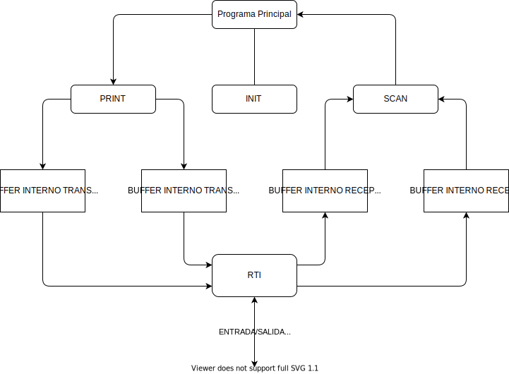

        

# 
Proyecto de Arquitectura de Computadores Sistemas de Entrada/Salida

Curso 2020/2021

        

## Informacion

| Informacion del proyecto: |  |   
| ----------- | --------
| Titulación  | Grado de Ingeniería Informática. Plan 09.
| Curso         | 2020/21
| Asignatura     | Arquitectura de Computadores
| Curso		 | 2º Curso
| Semestre    | 5º Semestre
| Proyecto    | Proyecto Entrada/Salida
  

## Autores
- Sara Sanchez Mota [180423]
- Francisco Javier Serrano Arrese [180487]

## Indice

- [Proyecto Entrada/Salida](#proyecto-de-arquitectura-de-computadores-sistemas-de-entrada/salida)
  * [Informacion](#informacion)
  * [Autores](#autores)
  * [Indice](#indice)
  * [Aspectos generales](#aspectos-generales)
  * [Diagrama de flujo](#diagrama-de-flujo)
  * [Subrutinas](#subrutinas)
    + [LEECAR](#leecar)
      - [Parametros de entrada](#parametros-de-entrada)
      - [Descripcion](#descripcion)
      - [Parametros de salida](#parametros-de-salida)
    + [ESCCAR](#esccar)
      - [Parametros de entrada](#parametros-de-entrada-1)
      - [Descripcion](#descripcion-1)
      - [Parametros de salida](#parametros-de-salida-1)
    + [INIT](#init)
      - [Descripcion](#descripcion-2)
    + [SCAN](#scan)
      - [Parametros de entrada](#parametros-de-entrada-2)
      - [Descripcion](#descripcion-3)
      - [Parametros de salida](#parametros-de-salida-2)
    + [PRINT](#print)
      - [Parametros de entrada](#parametros-de-entrada-3)
      - [Descripcion](#descripcion-4)
      - [Parametros de salida](#parametros-de-salida-3)
    + [RTI](#rti)
      - [Descripcion](#descripcion-5)
  * [Casos de prueba](#casos-de-prueba)
    + [AMENTET](#amentet)
    + [Hito](#hito)
    + [SCAN y PRINT](#scan-y-print)
    + [RTI](#rti-1)
  * [Observaciones finales](#observaciones-finales)
    + [ASCII Fonts](#ascii-fonts)

## Aspectos generales

El proyecto consiste en controlar el manejo de operaciones de Entrada/Salida en un periferico mediante interrupciones. El dispositivo elegido es la DUART MC68681 operando ambas lineas mediante interrupciones. En el computador del proyecto la DUART esta conectada a la linea de peticion de interrupcion de nivel 4.

 

El diagrama de flujo del proyecto se muestra mas adelante en la seccion homonima. Para el desarrollo del proyecto, se necesitan unos bufferes internos para almacenar los caracteres que se reciben asincronamente por las lineas. Del mismo modo, se necesitan sendos bufferes internos para almacenar los caracteres pendientes de transmitirse por las lineas.

 

Se cuenta con 4 bufferes en total, 2 de recepcion (BUFF_0 y BUFF_1) y otros 2 de transmision (BUFF_2 y BUFF_3). Estos bufferes son de tipo circular y hacen uso de un byte extra de tipo burbuja para asegurar su correcto funcionamiento. Las direcciones de estos bufferes en memoria estan contenidas en un vector de direcciones de bufferes denominado buffer vector (BUFFER_V). Cada buffer cuenta a su vez con dos punteros de manejeo, uno de insercion y otro de extraccion junto con dos punteros de posicion en memoria, uno de inicio y otro de final. Los dos ultimos tinen un proposito meramente de debugging.

 

Ademas, existe una unica rutina de tratamiento de las interrupciones de las lineas que sera la encargada transferir la informacion a o desde los mencionados bufferes internos. El proyecto implica la porgramacion de la rutina de tratamiento de las interrupciones (RTI) junto con las subrutinas INIT, SCAN, PRINT, LEECAR y ESCCAR cuyas caracteristicas de desarrollaran detalladamente en la seccion "Subrutinas".

 

Por ultimo aclarar ciertos detalles del proyecto. En primer lugar, se empieza la codificacion a partir de la direccion de memoria $400 y el puntero de pila es descendente y comienza en la direccion $8000. A su vez, la direccion para almacenar datos en memoria para las pruebas es la $5000 y es creciente. Los bufferes internos ocupan 2017 (2000 B de datos, 1 B burbuja, 16 B punteros), estos bufferes estan comprendidos entre las posiciones $410 y $2397. Por ultimo aclarar que se hace una copia del IMR denominada IMRCOPY debido a que no se puede leer directamente de este, y las direcciones de las lineas a y b son EFFC07 y EFFC17 respectivamente.

## Diagrama de flujo

En primer lugar, el programa principal llama a la subrutina INIT, desde la cual se inicializaran todos los valores necesarios para el correcto funcionamiento del programa. Alguno de estos valores son: vector de interrupcion, velocidad de transmision y recepcion, inhibicion de las interrupciones, IMR y desactivacion del eco. A su vez se inicializan los punteros tanto del vector de buffers "BUFF_V" como de los bufferes en si con sus respectivos punteros para asegurar su correcto funcionamiento circular.

El programa principal llama indefinidamente a SCAN haste que logra leer de uno de los puertos (A o B) un bloque de caracteres del tamano especificado y seguidamente llama indefinidamente a la subrutina PRINT hasta que logra imprimir en el puerto deseado (A o B) todos los caracteres leidos en paquetes de caracteres de tamano seleccionado. Este proceso se repite indefinidamente.

A la hora de llamar desde el programa principal a SCAN, este le debe especificar en que buffer desea almacenar los caracteres leidos en funcion de la linea desde donde se recibe estos. Siendo la direccion de este buffer variable en funcion de la iteracion ya que para insertar caracteres en el buffer no siempre se cuenta con el mismo valor del puntero.

Cabe destacar que algunos valores como por ejemplo las direcciones de las lineas A y B han sido definidos posteriormente a la direccion de memoria $400, de esta manera, el programa pricipal es capaz de recibir o transmitir caracteres de estas lineas.

Para concluir, cabe destacar que este programa hace un conteo de los caracteres recibidos y transmitidos ya que es posible que los tamanos de transmision y recepcion difieran, de tal manera que si SCAN recibe y escribe en sus bufferes internos X caracteres es posible que PRINT tenga que ser llamado varias veces al ser el tamano de transmision Y para todo Y mayor que 0 y menor que X. Tambien puede suceder al contrario, de tal manera que se debe codificar correctamente PRINT para que sea capaz de escribir menos caracteres de los indicados a la llamada y tan solo escribir los caracteres disponibles en los bufferes usados por SCAN.

A su vez, se debe asegurar el funcionamiento del programa en caso de errores como solicitud de lecturas y/o escrituras de caracteres negativos, descriptores de bufferes incorrectos y demas fallos.

  

Figura 1: Diagrama de flujo

## Subrutinas

En esta seccion se mencionara el funcionamiento de las diferentes subrutinas desarrolladas para este proyecto, estas son: LEECAR, ESCCAR, INIT, SCAN, PRINT y RTI desarrolladas es ese orden.

### LEECAR

#### Parametros de entrada

| Parametro | Buffer |
| :-: | :-: |
| Tamano | 4 |
| Modo Paso | Valor |
| Lugar Paso | D0 |
| Descripcion | Indica de que buffer extraer |

> **Nota:**
> El tamano se mide en bytes

  

#### Descripcion

La rutina leecar extrae un caracter del buffer interno indicado en el parametro de entrada buffer descrito anteriormente. Si dicho buffer esta vacio, la funcion devolvera a modo de error el valor #-1 y el buffer no se vera alterado. En caso de que el buffer tenga caractereres, se extraera el primer caracter moviendo el puntero de extraccion una posicion y almacenando dicho caracter en el registro D0

#### Parametros de salida
| Parametro | Caracter |
| :-: | :-: |
| Tamano | 4 |
| Modo Paso | Valor |
| Lugar Paso | D0 |
| Descripcion | Devuelve el caracter extraido o -1 |

### ESCCAR

#### Parametros de entrada

| Parametro | Buffer | Caracter |
| :-: | :-: | :-: |
| Tamano | 4 | 1 |
| Modo Paso | Valor | Valor |
| Lugar Paso | D0 | D1 |
| Descripcion | Indica en que buffer insertar | Caracter a insertar |

  

#### Descripcion

La rutina esccar inserta el caracter del segundo parametro en el buffer indicado por el primero. Se hace una comprobacion de la disponibilidad del buffer y en caso de que este lleno, se devuelve un #-1 como signo de error y el buffer no se vera alterado. En caso de que haya espacio en el buffer para insertar caracteres, este se insertara en la posicion indicada por el puntero de insercion del buffer en cuestion y se devolvera 0 en D0 a la subritina llamante.

#### Parametros de salida
| Parametro | Caracter |
| :-: | :-: |
| Tamano | 4 |
| Modo Paso | Valor |
| Lugar Paso | D0 |
| Descripcion | Devuelve 0 si bien o -1 si error |

### INIT

#### Descripcion

La subrituna init no cuenta con parametros de entrada ni de salida, su funcion es preparar las lineas A y B para la transmision y recepcion de caracteres mediante E/S por interrupciones. Los parametros de inicializacion de la subrutina son: 8 bits por caracter para ambas lineas, no activar eco en ninguna de las lineas, solicitar una interrupcion cada vez que llegue un caracter, velocidad de transmision y recepcion de 38400 bits/s, funcionamiento FUll Duplex, vector de interrupcion $40, habilitar las interrupciones de recepcion de las lineas en la mascara de interrupcion, actualizar la direccion de la rutina de tratamiento de interrupcion en la tabla de vectores de interrupcion y por ultimo no olvidar realizar la copia de IMR dado que no se puede leer de este valor.
 
En el caso particular de nuestra practica, ademas de los elementos indicados anteriormente habra que inicializar el vector de bufferes (BUFF_V) con la direccion de memoria de los 4 bufferes y en cada uno de estos bufferes hay que inicializar los 4 diferentes punteros: el de insercion, extraccion, inicio y fin. Siendo los dos ultimos meramente una simplificacion del proceso de debugging pero no tienen un impacto significativo en el codigo.

### SCAN

#### Parametros de entrada

| Parametro | Buffer | Descriptor | Tamano |
| :-: | :-: | :-: | :-: |
| Tamano | 4 | 2 | 2 |
| Modo Paso | Direccion | Valor | Valor |
| Lugar Paso | Pila | Pila | Pila |
| Descripcion | Indica el buffer donde devolver caracteres leidos del dispositivo | Indica la linea sobre la que leer | Numero maximo de caracteres a leer |

  

#### Descripcion

Scan lee un bloque de caracteres de una linea (A o B), esta lectura se realiza de forma no bloqueante de tal manera que "elimina" los caracteres leidos de las lineas haciendo uso de la funcion LEECAR a la que llama recursivamente hasta leer el numero de caracteres indicado en el tercer parametro de la subrutina. A su vez se hace el conteo de caracteres leidos en D0. Es importante asegurar que no suceden problemas de concurrencia como puede ser la lectura multiple del mismo caracter.

#### Parametros de salida

| Parametro | Leidos |
| :-: | :-: |
| Tamano | 4 |
| Modo Paso | Valor |
| Lugar Paso | D0 |
| Descripcion | Devuelve el numero de caracteres leidos de la linea |

### PRINT

#### Parametros de entrada

| Parametro | Buffer | Descriptor | Tamano |
| :-: | :-: | :-: | :-: |
| Tamano | 4 | 2 | 2 |
| Modo Paso | Direccion | Valor | Valor |
| Lugar Paso | Pila | Pila | Pila |
| Descripcion | Indica el buffer donde leer caracteres para escribir en el dispositivo | Indica la linea sobre la que escribir | Numero maximo de caracteres a escribir |

  

#### Descripcion

Print escribe en el buffer interno indicado el numero de caracteres indicados en el parametro tamano, contenidos en el buffer que se pasa como primer parametro. La escritura se realiza de forma no bloqueante activando de forma adecuada la transmision de caracteres si interferir con otras. La copia de los caracteres se realiza mediante la invocacion recursiva a la funcion ESCCAR el numero de veces indicado por tamano o hasta que el buffer ESCCAR se llene.
 
En esta subrutina es crucial comprender el funcionamiento de los diferentes registros y variables que maneja la DUART. En nuestro caso, la seccion del mutex, la cual comienza a partir de la etiqueta PR_MTX (print mutex) se encarga de solicitar la interrupcion de forma que no cause problemas de concurrencia. Para ello salvamos el valor del SR (status register), inhibimos las interrupciones guardando el valor $2700 en SR, activamos el bit de la IMR indicado (0 en caso de tratarse de la linea A y 4 para la linea B) y finalmente restauramos el valor anterior del SR, saltando asi al tratado de la interrupcion que se detalla en le siguiente subrutina, RTI.

#### Parametros de salida

| Parametro | Leidos |
| :-: | :-: |
| Tamano | 4 |
| Modo Paso | Valor |
| Lugar Paso | D0 |
| Descripcion | Devuelve el numero de caracteres disponibles para escribir o -1 en caso de error |

### RTI

#### Descripcion

El proceso de la rutina del tratamiento de interrupcion esta definido en los siguientes pasos:

**Identificacion de la fuente de interrupcion:** debido a que el MC68681 activa una misma senal de interrupcion para las cuatro condiciones posibles, esta subrutina debe identificar cual de las cuatro posibles condiciones ha generado la solicitud de interrupcion. Para ello, hacemos la operacion AND sobre los registros ISR e IMR y de esta manera se comprueba que bits estan activados en ambos registros. De ahi saltamos al tratamiento de la interrupcion identificada o finalizamos la subrutina al no haber identificado una interrupcion que atane a las lineas de recepcion o transmision A o B. 
 

**Tratamiento de la interrupcion:** si la interrupcion es de recepcion, esto significa que la cola FIFO de recepcion de la linea no esta vacia. Por ello, se debe guardar el caracter de esta linea en el buffer de recepcion correspondiente (buffers 0 o 1 en nuestro buffer vector). Destacar el uso de ESCCAR para poder escribir en los bufferes internos los caracteres desde las lineas de transmision.

Si la interrupcion es de transmision, indica que la linea esta preparada para transmitir un caracter. Si quedan caracteres en el buffer interno de transmision de esta linea, se debe hacer uso de la subrutina LEECAR indicando la direccion de la linea en la que se desea devolver este caracter.
 

**Situaciones especiales:** en caso de que el buffer de recepcion este lleno, adivinando este hecho debido a que ESCCAR nos devolvera el valor #-1 en D0. El proceso a seguir es leer el caractere de la linea de recepcion pero no escribirlo, de esta manera este caracter sera deshechado.

En el caso de que la interrupcion de transmision a la hora de leer un caracter con el uso de la subrutina LEECAR devuelva un #-1, esto significara que no hay mas caracteres que mandar a la linea de transmision seleccionada. El procedimiento a seguir es dehabilitar las interrupciones de transmision para la linea que la interrumpio en el registro IMR.

## Casos de prueba

A continuacion vamos a describir el conjunto de casos de prueba utilizados para la depuracion y el testing de las subrutinas descritas en el apartado anterior y asegurar su correcto funcionamiento, cumpliendo con las especificaciones indicadas en el manual del proyecto.

### AMENTET

Se ha desarrollado una subrutina principal desde la que se controla y notifica los errores que puedan surgir a la hora de probar las subrutinas. Esta subrutina la hemos denominado "Amentet" haciendo referencia a la diosa egipcia que decidia si un muerto pasaba al paraiso o al infierno tras su larga travesia por el rio. Analogamente, esta subrutina detecta si algun caso ha sido erroneo, y de ser asi, guarda en todos los registros el valor $FFFFFFFF, de este modo se analiza de forma visual el error generado en los tests.
  

### Hito

Los primeros casos de prueba que se desarrollaron fueron los relacionados con las subrutinas LEECAR y ESCCAR, las cuales estan incluidas en el hito evaluable del proyecto. En estos casos de prueba se testeaba desde los casos mas esenciales como puede ser leer o escribir un caracter, hasta casos mas particulares como puede ser, leer caracteres de un buffer vacio, o escribir caracteres en un buffer lleno. Con este conjunto de pruebas se comprobaba que nuestas subrutinas eran capaces de reaccionar de forma adecuada ante los errores o posibles problemas que puedan derivarse desde las subrutinas llamantes.
  

### SCAN y PRINT

Posteriormente se desarrollaron los casos de prueba para las subrutinas SCAN y PRINT. Para el desarrollo de estas pruebas era necesario haber testeado previamente el correcto funcionamiento de las subrutinas LEECAR y ESCCAR ya que se llamaba a estas para guardar caracteres en algun buffer o a partir de alguna direccion de memoria especifica. Para ambas subrutinas ademas de comprobar el funcionamiento basico como extraccion o insercion de varios caracteres, se comprobo que el funcionamiento fuera adecuado para los casos limite. Estos casos son, por ejemplo, descriptor de buffer incorrecto, numero de caracteres negativo, direccion de memoria no valida. A su vez se analizaba que tanto PRINT como SCAN interpretaran bien la recepcion del valor #-1 y asegurando que en ese instante no se leian ni escribian mas caracteres. A su vez se analizo que en ningun caso se superase el numero de caracteres a leer o escribir que los indicados por el parametro de entrada "tamano" de ambas subrutinas.
  

### RTI

Por ultimo se hizo el desarrollo del programa principal que probase el correcto funcionamiento de la subrutina RTI en conjunto con el resto de las subrutinas. Para ello se establecian parametros inciales como tamanos de recepcion y transmision o destino en memoria donde guardar determinados caracteres. El algoritmo de esta rutina principal es similar al descrito en el apartado de diagrama de flujo. Para el correcto funcionamiento de esta rutina, era necesario habilitar las interrupciones. Esto se logra guardando el valor $2000 el registro SR. La recepcion y transmision de las lineas A y B se realizaba editando los ficheros puertoa y puertob con el comando odt -x "nombre fichero".

## Observaciones finales

### ASCII Fonts

https://manytools.org/hacker-tools/ascii-banner/

    - Big ASCII font: DOS Rebel
    - Small ASCII font: ANSI Shadow
